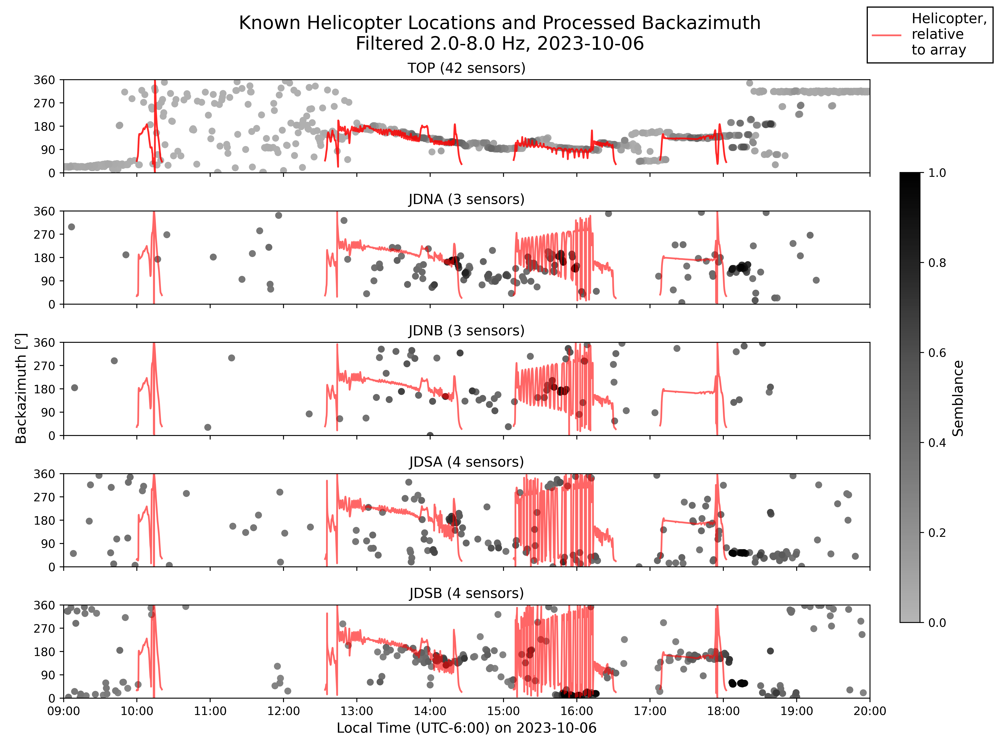
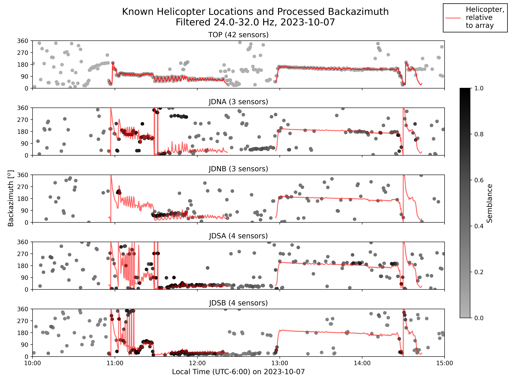

# Beamforming Analysis of Infrasound Signals from Rangeland Fire
Array processing code and results from infrasound data collected at the Reynolds Creek Experimental Watershed (RCEW) prescribed burn from 06 to 07 Oct 2023. 

## Usage
### Getting Started

### Workflow
1. **Pre-Process Data**: Use `preprocess.py` to plot raw traces and inspect. Note if any traces should be removed from processing. Re-run to pre-process data (e.g. shift traces back by an integer number of seconds). This script will read raw mseed files from `data/raw/` and save pre-processed data in `data/mseed/` directory. 

2. **Process Data**: Use `beamform.py` to process data with conventional shift-and-stack beamforming. This script will produce backazimuth and slowness plots in `figures`, and will save processed data as a pkl file to `data/processed/`. 

3. **Crossbeam**: Use `crossbeam.py` to calculate intersections between arrays and compare triangulated locations with known locations from helicopter data. 

4. **Create Figures**: Use scripts in `plot_code/` to create figures from processed data.

## Repository Overview

**`code/`**

&nbsp;&nbsp;&nbsp;&nbsp;`plot_code/`: Scripts to create figures.

&nbsp;&nbsp;&nbsp;&nbsp;`sbatch_scripts/`: Scripts to run processing code in parallel. These are used on BSU's high-performance computing cluster, Borah.

&nbsp;&nbsp;&nbsp;&nbsp;`tests/`: Scripts to test various functions.

&nbsp;&nbsp;&nbsp;&nbsp;`beamform.py`: Code with command-line interface to process data using the obspy `array_processing()` function.

&nbsp;&nbsp;&nbsp;&nbsp;`crossbeam.py`: Uses data processed with `beamform.py`, and corssbeams to find intersection points between all 5 arrays (TOP, JD*).

&nbsp;&nbsp;&nbsp;&nbsp;`preprocess.py`: Code with command-line interface to pre-process data before using `beamform.py`.

&nbsp;&nbsp;&nbsp;&nbsp;`settings.py`: List of path variables used by other files. These should be changed before running this code.

&nbsp;&nbsp;&nbsp;&nbsp;`utils.py`: Utility functions used by other files.

**`figures/`** Includes a few sample figures produced by the code and shown here in the README.

For data, including raw miniseed files, GPS survey coordinates, and processed beamforming results, contact M. Hunt.

## Field Site
The study region is the Reynolds Creek Experimental Watershed (RCEW), located in the Owyhee Mountains of southwestern Idaho, about 80 km southwest of Boise, ID. A prescribed burn was carried out in RCEW by the Bureau of Land Management on 06 Oct 2023, with an intended purpose of decreasing the juniper population for grazing cattle. The proposed prescribed burn area was approximately 9.4 km2. The elevation of the burn region ranges from 1457 m to 1870 m, with slopes from 0-25%.

In total, 75 infrasound sensors were deployed in arrays within the burn area and surrounding region between Aug and Oct 2023, including the 44-element TOP array.

<figure>

    
    <figcaption> <i> Severity of RCEW prescribed burn on 06 Oct 2023. Normalized Burn Ratio (NBR) calculated with B8A and B12 (NIR, SWIR) from 20 m resolution Sentinel-2 images corrected to surface reflectance. Differenced NBR (dNBR), calculated between pre-burn (2023-09-28) and post-burn (2023-10-08) images, ranges from unburned land (light grey) to low severity (yellow) to moderate severity (dark red). Proposed extent of prescribed burn (black outline) sourced from the BLM. Infrasound sensor arrays (blue triangles) surveyed in Oct 2023. Elevation contour lines (dark grey) are 1:24000, sourced from the USGS. </i> </figcaption>

</figure>

## Beamforming Results

<figure>

    
    <figcaption> <i> Backazimuth over time for data filtered between 2-8 Hz, the fire infrasound band. </i> </figcaption>

</figure>

<figure>

    
    <figcaption> <i> Backazimuth over time for data filtered between 24-32 Hz, the helicopter infrasound band. </i> </figcaption>

</figure>